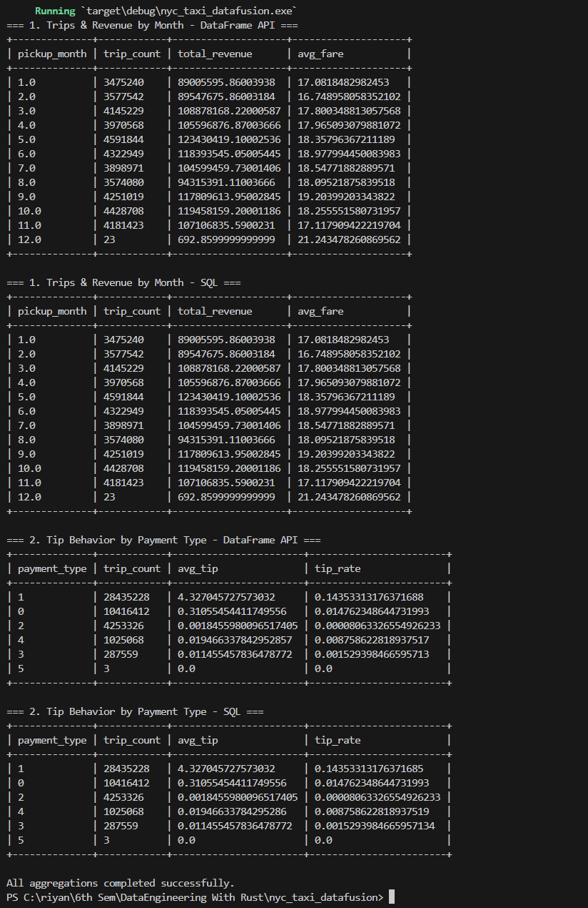

# NYC Taxi Data Analysis using Rust and DataFusion
# Project Description

This Rust application analyzes NYC TLC Yellow Taxi trip data for the full year of 2025 using Apache DataFusion.

# What the Project Does

Reads all 12 monthly Yellow Taxi Parquet files for the year 2025

Loads the dataset into Apache DataFusion

Computes analytical aggregations using both the DataFrame API and SQL queries

Prints summarized tables showing trip statistics and tip behavior

# Dataset Source

NYC TLC Trip Record Data

https://www.nyc.gov/site/tlc/about/tlc-trip-record-data.page 

How to Download the Data

Go to the NYC TLC Trip Record Data page.

Download the Yellow Taxi Trip Records for 2025 (January to December).

Create a folder named data in the project directory.

Place all downloaded Parquet files inside the folder.

Example:

data/
yellow_tripdata_2025-01.parquet
yellow_tripdata_2025-02.parquet
yellow_tripdata_2025-03.parquet
...
yellow_tripdata_2025-11.parquet

The Parquet files are not included in this repository because of their large size.

# How to Run the Project

Clone the repository:

git clone https://github.com/shaikr34-boop/nyc_taxi_datafusion 

Navigate to the project directory:

cd nyc_taxi_datafusion

Run the program:

cargo run

The application will load the dataset and print aggregation results to the terminal.

# Aggregations
Aggregation 1: Trips and Revenue by Month

This aggregation groups taxi trips by pickup month and calculates the total number of trips, total revenue, and the average fare amount for each month. It helps analyze monthly taxi demand and revenue trends.

Aggregation 2: Tip Behavior by Payment Type

This aggregation groups trips by payment type and calculates trip count, average tip amount, and tip rate. It helps understand tipping behavior across different payment methods.

# Output Screenshot

The dataset files are excluded from this repository to avoid uploading large files. Only the source code and output screenshot are included.